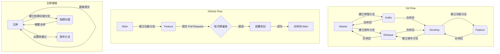

# Git 工作流程比較：Git Flow、GitHub Flow 和主幹開發

本文將詳細介紹三種常見的 Git 工作流程：Git Flow、GitHub Flow 和主幹開發（Trunk-Based Development）。我們會探討每種流程的特點、優缺點，並提供視覺化的流程圖以助理解。

## 流程圖比較

以下流程圖展示了三種 Git 工作流程的主要特點和分支策略：

## 詳細說明

### 1. Git Flow

Git Flow 是一個較為複雜但結構完整的分支管理模型，適合有計畫性發布的大型專案。

#### 主要分支
- **Master**：儲存穩定、可發布的程式碼
- **Develop**：開發分支，整合所有功能

#### 支援分支
- **Feature**：用於開發新功能
- **Release**：準備發布版本
- **Hotfix**：用於修復正式環境的緊急問題

#### 工作流程
1. 從 Develop 分支建立 Feature 分支進行新功能開發
2. 完成後合併回 Develop 分支
3. 當 Develop 分支達到可發布狀態時，建立 Release 分支
4. 在 Release 分支進行最後的測試和調整
5. 測試通過後，將 Release 分支合併到 Master 和 Develop
6. 若需緊急修復，從 Master 建立 Hotfix 分支
7. 修復後合併回 Master 和 Develop

#### 優點
- 結構清晰，適合大型專案
- 支援並行開發多個版本

#### 缺點
- 較為複雜，學習成本高
- 可能導致延遲整合，增加合併衝突風險

### 2. GitHub Flow

GitHub Flow 是一個簡單、以功能為導向的工作流程，適合持續部署的專案。

#### 主要分支
- **Main**（或 Master）：唯一的長期分支，隨時可部署

#### 工作流程
1. 從 Main 分支建立功能分支
2. 在功能分支上進行開發和提交
3. 建立 Pull Request，進行程式碼審查
4. 討論和修改程式碼
5. 部署分支到正式環境進行測試
6. 合併到 Main 分支並部署

#### 優點
- 簡單直接，易於理解和使用
- 支援持續整合和部署
- 鼓勵頻繁的程式碼審查

#### 缺點
- 不適合需要維護多個版本的專案
- 可能導致 Main 分支不穩定（如果沒有嚴格的審查和測試）

### 3. 主幹開發（Trunk-Based Development）

主幹開發是一種以主幹為中心的開發方法，強調頻繁整合和小批量提交。

#### 主要分支
- **主幹**（通常是 Main 或 Master）：主要開發分支

#### 工作流程
1. 大部分開發直接在主幹上進行
2. 對於較大的功能，建立短期功能分支
3. 頻繁地將程式碼合併回主幹（至少每天一次）
4. 使用功能開關來控制未完成功能的可見性
5. 需要時，從主幹建立發布分支

#### 優點
- 支援持續整合和部署
- 減少長期分支，降低合併衝突風險
- 鼓勵小批量、頻繁的程式碼提交

#### 缺點
- 需要團隊具備較高的自動化測試水平
- 可能不適合需要長期維護多個版本的專案
- 對於大型功能開發可能較為困難

## 結論

選擇哪種工作流程取決於您的專案規模、團隊大小、發布頻率和開發文化：

- **Git Flow** 適合大型、有計畫性發布的專案
- **GitHub Flow** 適合小型、持續部署的專案
- **主幹開發** 適合追求快速迭代和持續整合的團隊

無論選擇哪種工作流程，重要的是要確保團隊成員都理解並遵循約定的流程，以確保專案的順利進行和程式碼的品質。
